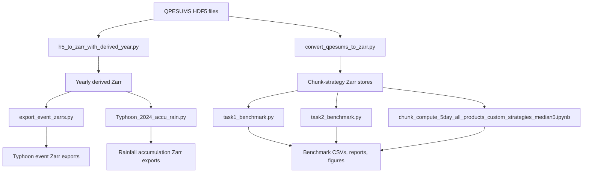
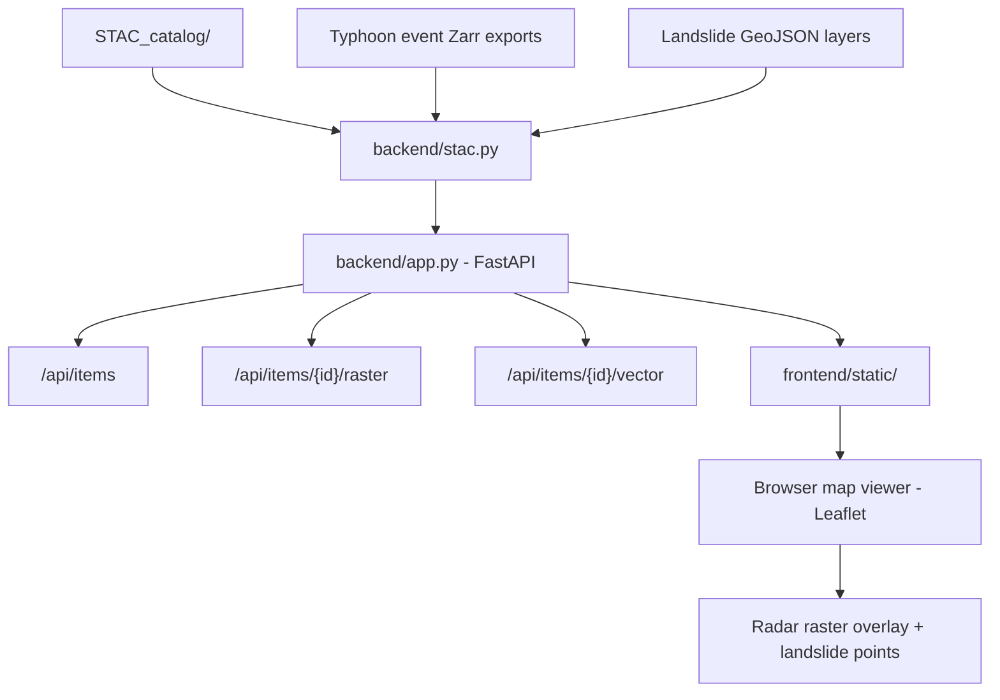

# QPESUMS 3D Radar Final Project

This repository contains two integrated components:

1. **ETL & Benchmarking** — converts QPESUMS HDF5 radar files to Zarr, derives
   radar products, exports typhoon-event datasets, and evaluates chunking
   strategies for efficient analysis with Dask.
2. **STAC-based Typhoon WebGIS** — a FastAPI backend and browser-based map
   viewer for exploring typhoon radar data (Zarr rasters) and landslide
   inventory layers (GeoJSON), organised as a STAC catalog.

## Final Submission Note

This copy was prepared for the Environmental Big Data final project submission
by Ping-Hung Yang. The repository keeps the upstream project history intact and
adds this note to identify the submitted copy and its intended course context.

## Architecture

### ETL & Benchmarking



### WebGIS Application



## Repository Contents

```text
.
├── backend/                   # FastAPI server
│   ├── app.py                 # API routes and server entry point
│   ├── stac.py                # STAC catalog parsing and asset resolution
│   └── render.py              # Zarr → PNG raster rendering
├── frontend/
│   └── static/
│       ├── app.js             # Leaflet-based map viewer
│       └── styles.css
├── catalog/                   # STAC catalog JSON metadata
│   ├── catalog.json
│   ├── gaemi/
│   ├── kong-rey/
│   ├── krathon/
│   └── usagi/
├── events/                    # Typhoon event data (Zarr + GeoJSON)
│   ├── Gaemi/
│   │   ├── QPESUMS/           # Radar product Zarr stores
│   │   └── landside_layers/   # Landslide GeoJSON
│   ├── KONG-REY/
│   ├── Krathon/
│   └── Usagi/
├── etl/                       # ETL scripts
│   ├── h5_to_zarr_with_derived_year.py
│   ├── export_event_zarrs.py
│   ├── convert_qpesums_to_zarr.py
│   └── Typhoon_2024_accu_rain.py
├── benchmarks/                # Benchmark scripts and notebooks
│   ├── task1_benchmark.py
│   ├── task2_benchmark.py
│   └── chunk_compute_5day_all_products_custom_strategies_median5.ipynb
├── main.py
├── pyproject.toml
├── uv.lock
├── .gitignore
└── README.md
```

## Environment Setup

This project uses `uv` for dependency management.

1. Install `uv` if it is not already available.

2. Create and sync the environment:

```bash
uv sync
```

3. Run commands inside the managed environment:

```bash
uv run python --version
```

The main workflow uses Python 3.11+ and Zarr v3.

## Input And Output Layout

The scripts use editable settings near the top of each file. Before running,
prepare local folders for:

```text
data/source_hdf5/          # raw QPESUMS HDF5 files
outputs/                  # generated Zarr stores and benchmark outputs
```

Large generated datasets are intentionally excluded from GitHub by `.gitignore`.
Only code, notebooks, environment files, and metadata should be committed.

## Step-By-Step Operation

### 1. Convert HDF5 To Yearly Derived Zarr

Edit the user settings in `h5_to_zarr_with_derived_year.py`:

- `HDF5_DIR`
- `OUTPUT_ZARR`
- `START_TIME` and `END_TIME`, if a subset is needed
- `BATCH_MODE`
- Dask worker settings

Run:

```bash
uv run python h5_to_zarr_with_derived_year.py
```

This creates a yearly Zarr dataset containing:

- `MAXDBZ`: 2D maximum reflectivity
- `DBZH`: 3D reflectivity
- `TOP18`: echo top height above 18 dBZ
- `TOP45`: echo top height above 45 dBZ
- `VIL`: vertically integrated liquid water

### 2. Export Typhoon Event Products

Edit the user settings in `export_event_zarrs.py`:

- `SOURCE_ZARR`
- `OUTPUT_ROOT`
- `EVENTS_UTC8`
- `EXTRA_HOURS_AFTER_CONVERSION`

Run:

```bash
uv run python export_event_zarrs.py
```

For each typhoon event, the script exports:

- `VIL.zarr`
- `EchoTop_18.zarr`
- `EchoTop_45.zarr`

Event dates are defined in UTC+8 and converted to UTC before slicing the radar
time coordinate.

### 3. Generate Chunk-Strategy Zarr Stores

Edit the user settings in `convert_qpesums_to_zarr.py`:

- `INPUT_DIR`
- `MISSING_CSV`
- `OUT_DIR`
- `BATCH_SIZE`
- `DBZH_STRATEGIES`
- `MAXDBZ_STRATEGIES`

Run:

```bash
uv run python convert_qpesums_to_zarr.py
```

This creates multiple Zarr stores for comparing chunk layouts of `DBZH` and
`MAXDBZ`.

### 4. Run MAXDBZ Rainfall Benchmark

Edit the user settings in `task1_benchmark.py`:

- `ROOT`
- `STORES`
- event time window
- Dask worker settings
- report, figure, and CSV output folders

Run:

```bash
uv run python task1_benchmark.py
```

This benchmark converts `MAXDBZ` to rain rate, computes accumulated rainfall,
and records latency, throughput, Dask task count, compute time, and transfer
time.

### 5. Run DBZH CFAD Benchmark

Edit the user settings in `task2_benchmark.py`:

- `ROOT`
- `STATION_CSV`
- `STORES`
- `STATION_BATCH_SIZE`
- Dask worker settings
- report, figure, and CSV output folders

Run:

```bash
uv run python task2_benchmark.py
```

This benchmark extracts vertical reflectivity profiles near selected stations
and builds CFAD histograms for each chunking strategy.

### 6. Run The Core Experiment Notebook

Open:

```text
chunk_compute_5day_all_products_custom_strategies_median5.ipynb
```

This is the core experiment notebook. It benchmarks a 5-day all-product
pipeline for `VIL`, `TOP18`, and `TOP45`, repeats runs, aggregates median and
mean performance metrics, and produces decision tables and figures.

### 7. Optional Rainfall Accumulation Export

Edit the user settings in `Typhoon_2024_accu_rain.py`:

- input `MAXDBZ` Zarr store
- output folder
- typhoon warning periods
- Z-R relationship constants

Run:

```bash
uv run python Typhoon_2024_accu_rain.py
```

This creates event-window Zarr stores containing `MAXDBZ`, `rain_rate`, and
`accum_rainfall`.

## Script Summary

### `h5_to_zarr_with_derived_year.py`

Main ETL script. Reads QPESUMS HDF5 files, applies gain/offset and no-data
masking, adds coordinates, computes `TOP18`, `TOP45`, and `VIL`, and writes an
analysis-ready Zarr store in batches with Dask.

### `export_event_zarrs.py`

Subsets the yearly derived Zarr store into typhoon-event products. It exports
VIL and echo-top products for each configured event.

### `convert_qpesums_to_zarr.py`

Creates benchmark Zarr stores using several chunking strategies for `DBZH` and
`MAXDBZ`.

### `task1_benchmark.py`

Benchmarks accumulated rainfall computation from `MAXDBZ` stores.

### `task2_benchmark.py`

Benchmarks station-profile extraction and CFAD generation from `DBZH` stores.

### `Typhoon_2024_accu_rain.py`

Exports typhoon-event rainfall accumulation products from a `MAXDBZ` Zarr
store.

### `chunk_compute_5day_all_products_custom_strategies_median5.ipynb`

Core experimental notebook for comparing 5-day all-product chunking strategies
using repeated benchmark runs and median-5 summaries.

## Running The WebGIS Application

The WebGIS viewer lets you browse typhoon radar products and landslide layers
on an interactive map.

### Prerequisites

Install dependencies (same environment as above):

```bash
uv sync
```

### Start The Server

```bash
uv run python main.py
```

Then open `http://localhost:8000` in your browser.

### What You Can Do

- Select a typhoon event from the left panel (Gaemi, KONG-REY, Krathon, Usagi)
- Choose a radar product (accumulated rainfall, MaxDBZ, VIL, echo top)
- Step through time frames or use the playback button
- Toggle the landslide inventory overlay on and off
- Click a landslide point to view its attributes

### STAC Catalog Structure

The `catalog/` directory organises all data assets as a static STAC catalog.
Each typhoon has its own sub-catalog with two collections:

- `*-qpesums-zarr/` — radar product Zarr stores (raster assets), pointing to
  files under `events/<typhoon>/QPESUMS/`
- `*-landcover/` — landslide inventory GeoJSON (vector assets), pointing to
  files under `events/<typhoon>/landside_layers/`

The backend reads this catalog at startup to discover available events and
assets without any database.

## Dataset Metadata

Dataset metadata is documented in:

```text
stac_catalog.json
```

The STAC catalog describes:

- source HDF5 assets
- yearly derived Zarr output
- typhoon event Zarr exports
- benchmark outputs
- spatial and temporal extent
- variables and processing software

The STAC file uses relative asset paths so the repository can be cloned and
reused in another environment without depending on machine-specific paths.

## Reproducibility Checklist

- Code assets are included as Python scripts.
- The core experiment notebook is included.
- `pyproject.toml` and `uv.lock` define the reproducible environment.
- `stac_catalog.json` documents dataset metadata.
- This README includes the architecture diagram and operation steps.
- Large generated data products are excluded from GitHub by `.gitignore`.
